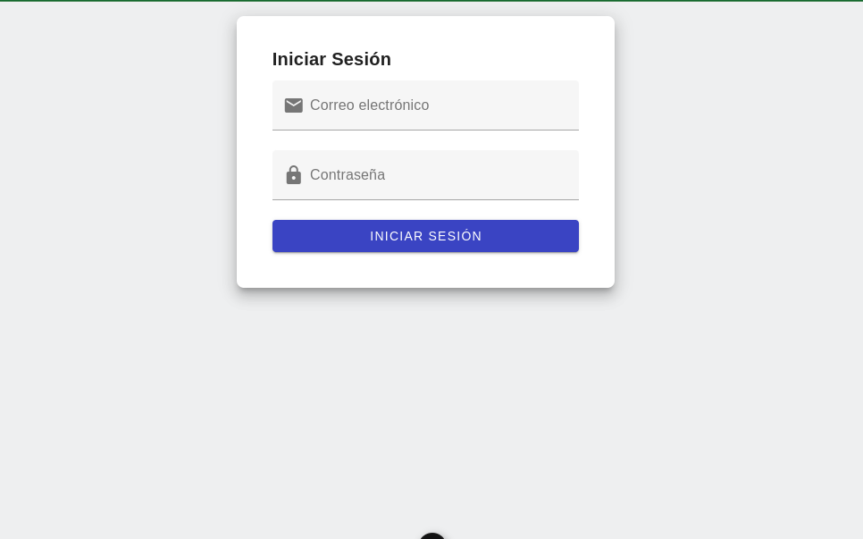
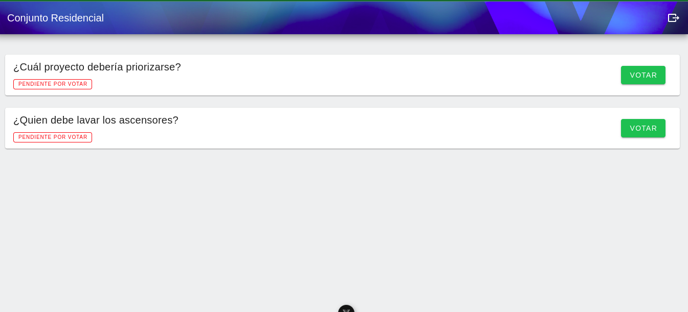
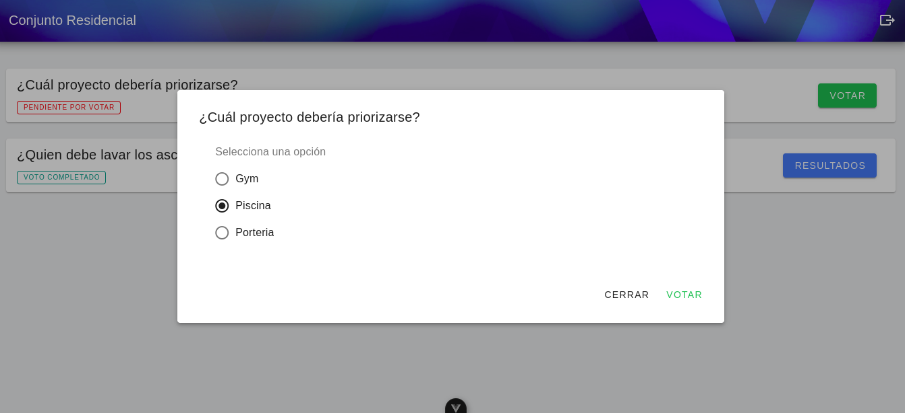
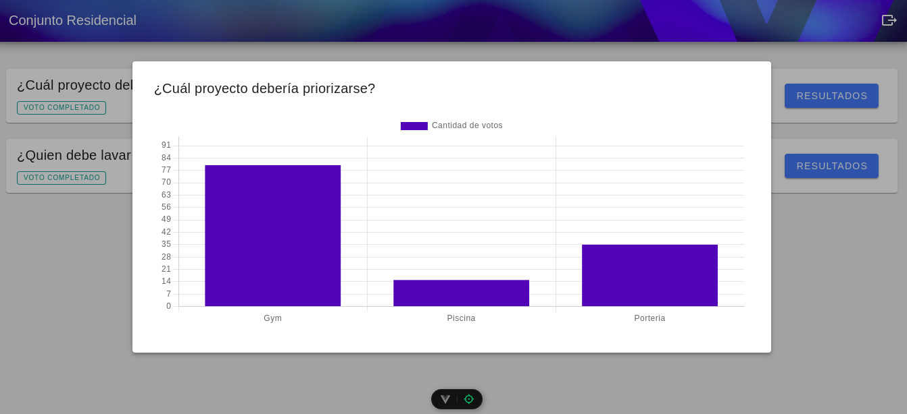
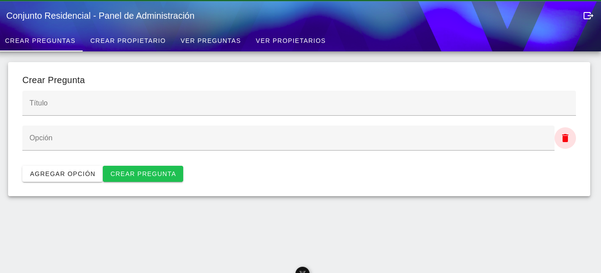
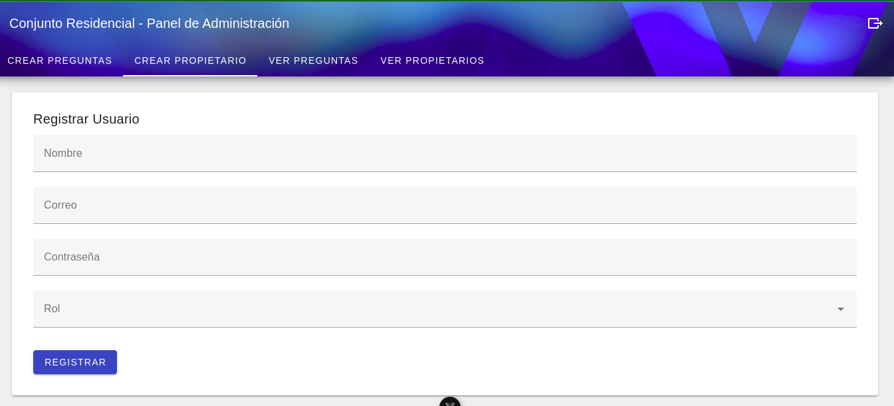
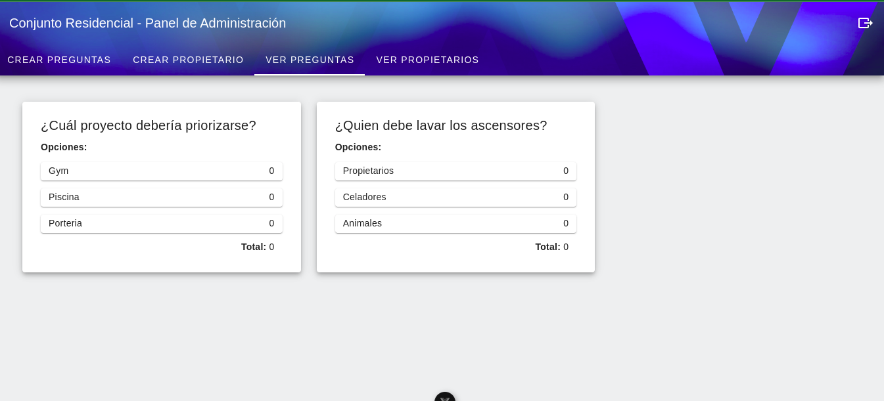

# Sistema de Votaciones - Fronted

Permite la gestión de usuarios, preguntas y votaciones para conjuntos residenciales o instituciones similares. Incluye autenticación con JWT, control de roles, lógica de votación única por usuario y documentación.

## Project Setup

```sh
npm install
```

```sh
npm run dev
```

```sh
npm run build
```

### Lint with [ESLint](https://eslint.org/)

```sh
npm run lint
```

---

## Imagenes de la Interfaz

### Login:



### User page:





### Admin Page:




